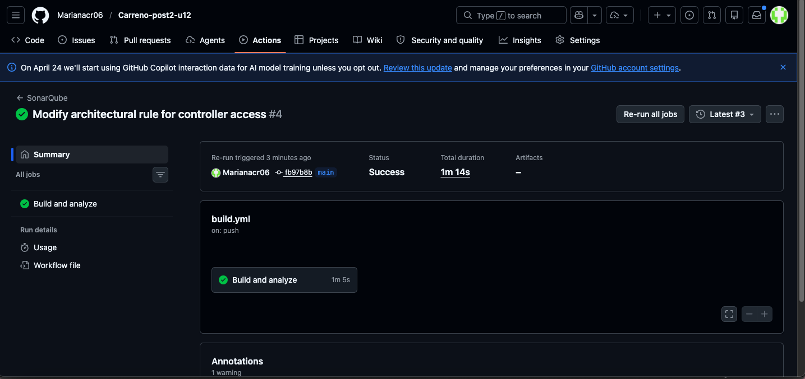
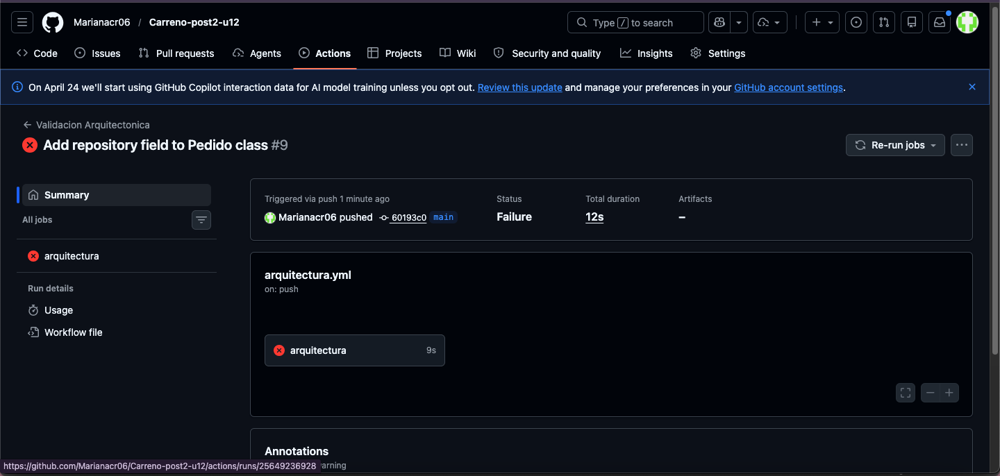

# Patrones de Diseño de Software - U12 Post 2
**Validación Arquitectónica con ArchUnit y ADR**  
Ingeniería de Sistemas - UDES 2026  
**Autora:** Mariana Carreño

---

## Objetivo

Implementar reglas de validación arquitectónica con ArchUnit sobre el sistema de pedidos, documentar tres decisiones de diseño en formato ADR, y verificar que las reglas se ejecutan automáticamente en GitHub Actions.

---

## Validación Arquitectónica con ArchUnit

Se implementaron 5 reglas arquitectónicas en `ReglasArquitectura.java`:

**Regla 1 — Dominio Aislado**  
El dominio no depende de infraestructura ni adaptadores. Garantiza que las entidades de negocio no importan clases de Spring, JPA ni adaptadores externos.

**Regla 2 — Controlador Solo Facade**  
Los controladores REST solo acceden a la Facade y al dominio. Evita que el controlador acople directamente con servicios internos.

**Regla 3 — Puertos Como Interfaces**  
Todos los puertos del dominio deben ser interfaces. Garantiza el contrato entre dominio e infraestructura.

**Regla 4 — Procesadores Implementan Puerto**  
Los procesadores de pedido deben implementar la interfaz `ProcesadorPedido`. Garantiza el contrato del patrón Strategy.

**Regla 5 — Infraestructura No Accede a REST**  
La infraestructura no puede acceder a los adaptadores REST. Evita dependencias invertidas entre capas.

---

## Pipeline GitHub Actions

El workflow `arquitectura.yml` ejecuta las reglas ArchUnit en cada push a `main`.

### Pipeline VERDE (reglas pasando)

### Pipeline ROJO (violación detectada)

---

## Decisiones Arquitectónicas (ADR)

- [ADR-001: Arquitectura Hexagonal](docs/adr/ADR-001.md)
- [ADR-002: Factory + Strategy](docs/adr/ADR-002.md)
- [ADR-003: Spring Events Observer](docs/adr/ADR-003.md)

---
